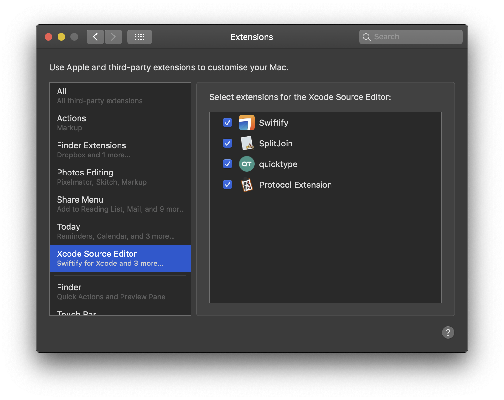
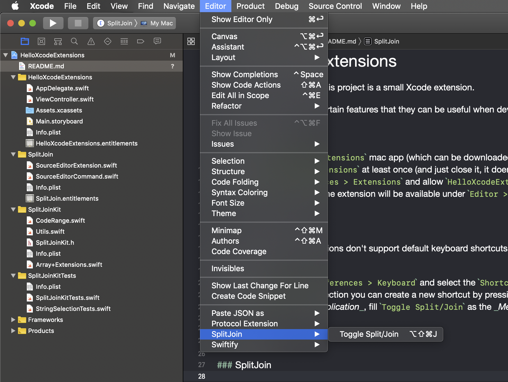
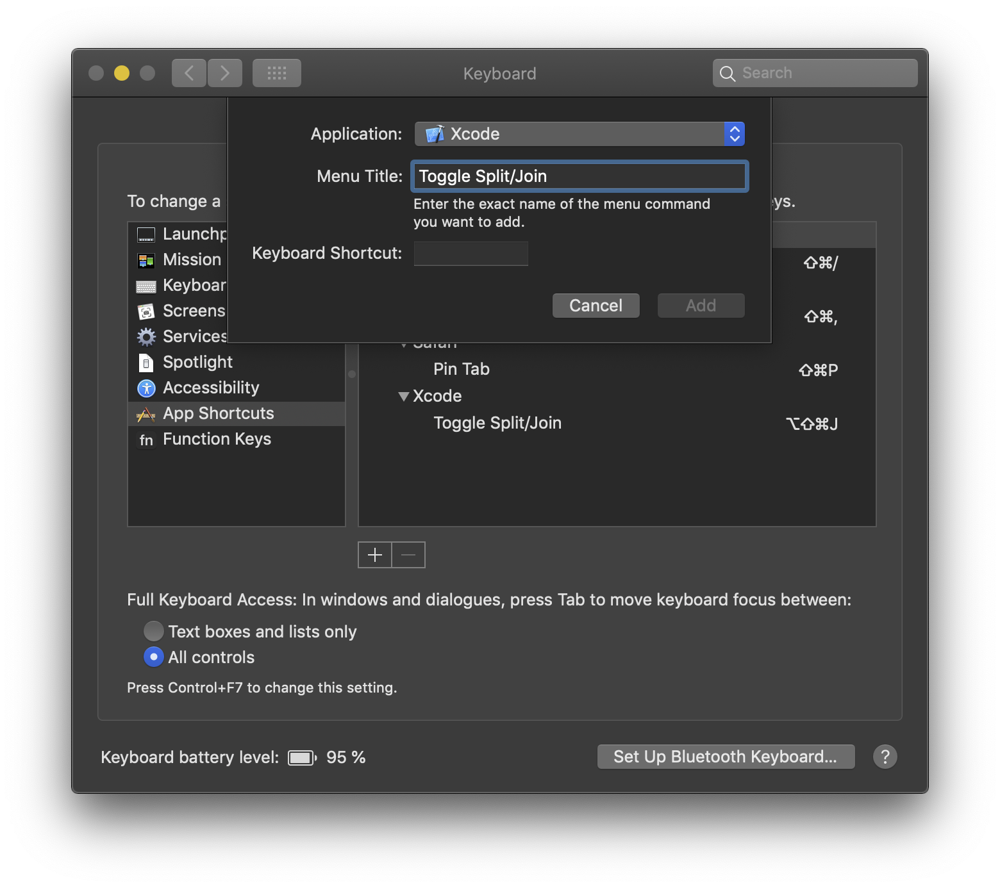

# HelloXcodeExtensions

For lack of a better name, this project is a small Xcode extension with a (growing) collection of edition utilities.


The idea is that I will add certain features that they can be useful when developing apps with Xcode which can be implemented via the Xcode Extensions architecture.

This is mostly a learning project and a place to put certain 

## Installation

1. Install the `HelloXcodeExtensions` mac app (which can be downloaded from [the releases page](https://github.com/fespinoza/HelloXcodeExtensions/releases/latest))
2. Run the `HelloXcodeExtensions` at least once (and just close it, it doens't do anything)
3. Open `System Preferences > Extensions` and allow `HelloXcodeExtensions` in the _Xcode Source Editor_ section.



4. Restart Xcode and then the extension will be available under `Editor > SplitJoin > Toggle Split/Join`



### Keyboard shortcut

Xcode Source Editor extensions don't support default keyboard shortcuts for excode extensions, so you must create one yourself.

To create one:
1. Open Open `System Preferences > Keyboard` and select the `Shortcuts` pane.
2. In the `App Shortcuts` section you can create a new shortcut by pressing the `+` button
3. Select `Xcode` as the _Application_, fill `Toggle Split/Join` as the _Menu Title_ and finally assign the keyboard shortcut you wish (A suggestion would be `⌘⇧⌥J`).



## Usage

### SplitJoin

Turns function calls from one line to multiple (or vice versa).

For example, given the following code

```swift
static let attributesStyle = SampleAttributeStyle(titleFont: .caption, titleColor: .textPrimary, titleNumberOfLines: 1, titleColomnFixedWidth: 130)
```

It can be reformatted with `Toggle Split/Join` to:

```swift
static let attributesStyle = SampleAttributeStyle(
    titleFont: .caption,
    titleColor: .textPrimary,
    titleNumberOfLines: 1,
    titleColomnFixedWidth: 130
)
```

## License 

MIT

## About Xcode Source Extensions

Xcode Source Editor Extensions are very limited, the basic of them is that they only work in one file at a time and just for string manipulation, so when using them you don't have semantic information about the source code.

To learn more about them, the best resource I found was [Xcode​Kit and Xcode Source Editor Extensions](https://nshipster.com/xcode-source-extensions/)
